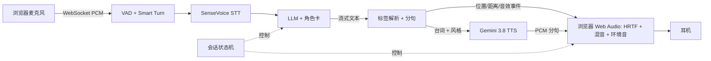
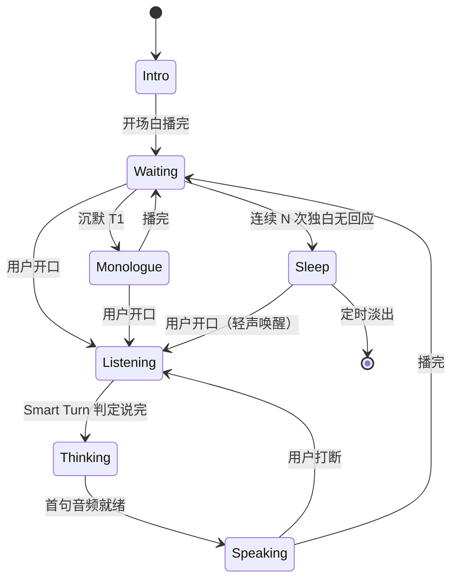

# 互动 ASMR：技术 Spec v0.1

Sep 26, 2026 · @david

## 背景与目标

做一个戴耳机、以语音进行的角色扮演 ASMR：用户说话，AI 用温和、贴耳、可定位的声音回应。GPT Live 这类端到端语音产品能对话但“太商务”、音色不可控；Gemini 3.8 Flash TTS（2026-09-23 发布）支持语气指令和 Voice Design，首次让“可控的温柔声线”变得便宜。

**目标（v1）**

- 中文为主的语音角色扮演，单用户、本地运行，浏览器作为前端
- AI 声线稳定、语气可随剧情变化（耳语、轻笑、叹气、停顿）
- 双耳空间感：声音能出现在左耳、右耳、贴近或远离
- 对“放松/入睡”友好：不抢话、不追问、可以一直陪着
- 每小时运行成本 < 1 美元

**非目标（v1）**

- 多用户、账号、部署上线
- Live2D/视觉形象
- 全双工（边说边听）与亚 500ms 延迟：ASMR 本身节奏慢，不追求
- 自训练 TTS 模型

## 核心体验

一次典型会话 20–60 分钟：选角色卡 → 戴耳机 → 环境音淡入 → 角色开场 → 自由对话 → 用户沉默或入睡后角色自己慢慢往下说 → 淡出。

**体验要求**

| 编号 | 要求 | 验收标准 |
| --- | --- | --- |
| X1 | 不抢话 | 用户句中停顿 1.5s 内不被打断，整场误抢 ≤ 1 次 |
| X2 | 可打断 | 用户开口后 AI 在 300ms 内淡出停止 |
| X3 | 声线一致 | 整场同一音色，无明显漂移 |
| X4 | 语气跟随剧情 | 耳语/轻笑/叹气按标签生效，标签本身不被念出来 |
| X5 | 空间感 | 左/右/贴近可盲听分辨 |
| X6 | 沉默不追问 | 用户长时间不说话，AI 不问“你还在吗” |
| X7 | 响度安全 | 输出响度归一化，无突然爆音 |

## 系统架构

采用级联流水线（STT → LLM → TTS），不用端到端语音模型：Gemini Live 不支持自定义音色，而音色和语气是本项目的核心。后端基于 Pipecat（Python），前端是浏览器页面，空间化在前端用 Web Audio 做。



| 模块 | 职责 | 运行位置 |
| --- | --- | --- |
| Transport | 浏览器 ↔ 后端的音频与事件通道（WebSocket，16kHz 上行 / 24kHz 下行） | 后端 |
| 轮次检测 | Silero VAD 判断有没有声音，Smart Turn 判断是否说完 | 后端 CPU |
| STT | 转写用户语音 | 后端（本地 GPU/CPU） |
| LLM | 按角色卡生成带标签的台词 | 云 API |
| 标签解析 | 切句、拆出风格和空间指令 | 后端 |
| TTS | 逐句合成，固定音色 | 云 API（可换本地） |
| 会话状态机 | 打断、沉默、入睡模式 | 后端 |
| 音频前端 | 播放队列、HRTF 定位、近场效果、环境音、响度限制 | 浏览器 |

## 组件选型

原则：骨架和中文 STT 现成拿，只自己写标签解析、空间化、沉默策略三块。

| 层 | 首选 | 备选 | 理由 / 借鉴来源 |
| --- | --- | --- | --- |
| 骨架 | [Pipecat](https://github.com/pipecat-ai/pipecat) | 自写 FastAPI + WebSocket（参考 [RealtimeVoiceChat](https://github.com/KoljaB/RealtimeVoiceChat)） | 打断、流式、帧流水线现成；已有 `GeminiTTSService` |
| VAD | Silero VAD | [TEN VAD](https://github.com/ten-framework/ten-vad) | Pipecat 内置 |
| 轮次检测 | [Smart Turn v3](https://github.com/pipecat-ai/smart-turn) | 加长静音阈值 | 支持中文，8MB，CPU 几十毫秒；对慢语速、多停顿友好 |
| STT | SenseVoice / FunASR（本地） | faster-whisper；Gemini 3.5 Transcribe | 中文快且准；接入代码参考 [Open-LLM-VTuber](https://github.com/Open-LLM-VTuber/Open-LLM-VTuber)、[bailing](https://github.com/wwbin2017/bailing) |
| LLM | 任意 OpenAI 兼容 API（DeepSeek / Gemini Flash / Claude） | 本地 Qwen | 角色卡沿用酒馆格式；需流式输出 |
| TTS | Gemini 3.8 Flash-Lite TTS + Voice Design 音色 | Flash TTS；本地 CosyVoice 3 | Lite 与 Flash 质量在误差内、便宜 1/3；需自写 Pipecat 子类接 3.8 和自定义音色 |
| 前端 | 原生 JS + Web Audio | Vue | `PannerNode` 自带 HRTF；参考 [AIRI 浏览器示例](https://github.com/proj-airi/webai-example-realtime-voice-chat) |

硬件假设：一张 8GB+ 显存 GPU 跑 STT；换本地 TTS 时需 12GB+。

## LLM 输出协议

LLM 输出普通文本加两类标记：方括号 `[...]` 是舞台指令，由解析器拆掉；尖括号 `<...>` 是 Gemini TTS 原生的声音事件，原样透传。不用 JSON，因为难以流式解析。

```
[pos: left, near] [style: 耳语，很轻，带一点笑意]
嗯……今天辛苦了。<sigh> 闭上眼睛，听我说就好。
[move: right, 3s]
我在这边哦。<short pause> 感觉到了吗？
[sfx: page_turn]
```

| 指令 | 取值 | 去向 |
| --- | --- | --- |
| `pos` | 方位 `left` / `right` / `front` / `behind`；距离 `near`（约 10cm）/ `mid`（约 50cm）/ `far`（约 1.5m） | 前端 PannerNode |
| `move` | 目标方位 + 时长 | 前端，线性插值方位角 |
| `style` | 自然语言语气描述，≤ 20 字 | TTS 风格参数 |
| `sfx` | 白名单：`page_turn`、`tea_pour`、`rain_up`、`rain_down` 等 | 前端音效库 |
| `<sigh>` `<laugh>` `<short pause>` `<cough>` | Gemini 文档列出的声音事件 | 原样留在台词里 |

**规则**

1. 指令持续有效，直到被下一条同类指令覆盖。
2. 解析器按 `。！？…～` 或满 40 字切句，每句连同当前 `style` 送 TTS。
3. 未知指令和未列出的尖括号标记一律丢弃并记日志，绝不进入 TTS 文本。
4. 系统提示词要求：短句、口语、少用书面语，每轮回复 1–4 句。

待验证：`style` 如何传给 TTS 才不会被念出来。Gemini TTS 不支持 system instruction，写在文本前缀里有被朗读的风险；M0 需要先对比“文本前缀”与 Pipecat Cloud 后端的 `prompt` 参数。

## 会话状态机

和通用语音助手最大的区别在这里：用户不说话是正常状态。沉默时 AI 进入“独白”，持续沉默就逐步退到只剩环境音，整个过程不提问。



| 参数 | 默认值 | 说明 |
| --- | --- | --- |
| T1（沉默转独白） | 12s | 每次独白后翻倍，上限 60s |
| N（转入睡） | 5 次 | 或累计沉默 10 分钟 |
| 独白衰减 | 每轮 −2dB、句数递减 | 让声音自然“远去” |
| 入睡定时 | 20 分钟 | 环境音淡出并结束会话 |

**实现要点**

- 打断：前端 150ms 内淡出并清空播放队列，后端取消未完成的 TTS 请求。对话历史只保留**实际播出**的句子，否则 LLM 会以为自己说完了。
- 独白触发时向 LLM 注入一条隐藏消息：“（对方安静着，可能快睡着了。按你的节奏继续，1–2 句，不要提问。）”
- 进入 Sleep 后用户再开口，首句回复强制使用最轻的 `style`。
- 麦克风开启浏览器 `echoCancellation`；戴耳机时回声很小，但外放调试时需要。

## 音频与空间化

空间化全部在浏览器里用 Web Audio 完成，后端只下发单声道 PCM 和位置事件。好处是零依赖、能实时移动声源，换 TTS 不影响这一层。

**人声链路**

```
TTS PCM(24kHz, mono)
  → BiquadFilter(lowshelf 200Hz, near 时 +4dB)   // 近讲效应
  → GainNode(距离增益)
  → PannerNode(panningModel="HRTF")            // 方位
  → [dry] + ConvolverNode(小房间 IR, wet 5–10%)
  → master: DynamicsCompressor(限幅 -3dBFS) → 耳机
```

**环境音链路**：立体声循环素材 → 独立 GainNode（默认 −18dB）→ master。不过 HRTF，避免和人声抢定位。`sfx` 音效走人声链路，跟角色位置走。

| 距离 | 坐标模长 | 低频提升 | 混响 wet |
| --- | --- | --- | --- |
| near | 0.1m | +4dB | 3% |
| mid | 0.5m | +1dB | 8% |
| far | 1.5m | 0dB | 15% |

坐标约定：听者在原点、面向 −z；`left` = −x，`right` = +x，`behind` = +z。`move` 用 `setTargetAtTime` 平滑过渡，避免跳变。

已知局限：浏览器自带的是通用远场 HRTF，不模拟 1m 以内的近场差异。贴耳感主要靠低频提升和干声来营造。如果 M2 试听不够真，M3 再换成基于 SOFA 数据集的卷积（可参考 [Binamix](https://github.com/QxLabIreland/Binamix/) 的 SADIE II 用法）。

## 延迟与成本预算

从用户说完到听到首句，预计要 2–3 秒，目标是中位数 ≤ 2.5 秒。成本约每小时 0.45 美元，2027 年涨价后约 0.8 美元，仍在 1 美元目标内。

**延迟预算（首句）**

| 环节 | 预算 | 依据 |
| --- | --- | --- |
| 轮次判定 | 300–600ms | VAD 静音 + Smart Turn（CPU 几十毫秒）；估算 |
| STT | 100–200ms | 整句识别；估算，M0 实测 |
| LLM 到首句完整 | 500–1000ms | 取决于模型；估算 |
| Gemini TTS 首包 | 900–1050ms | [社区实测](https://github.com/GetStream/Vision-Agents/pull/663) |
| 网络 + 播放缓冲 | 约 100ms | 估算 |

缓解办法：说完即播一段预先用同一音色生成好的应声词（“嗯……”“这样啊”），把等待包装成倾听。应声词缓存在本地，不计 API 成本。

**成本预算（每小时，假设 AI 说话 30 分钟）**

| 项 | 现价 | 2027-01-01 起 |
| --- | --- | --- |
| TTS（Flash-Lite，1.15¢/分钟） | $0.35 | $0.69 |
| TTS（若用 Flash，1.72¢/分钟） | $0.52 | $1.03 |
| LLM（便宜模型，约 25 万输入 token） | 约 $0.1 | 约 $0.1 |
| STT（本地） | $0 | $0 |

TTS 单价来源：[mxchat 实测](https://mxchat.ai/gemini-tts-pricing-tokens-per-second/)。实际计费约每秒 32 个 token，比官方写的 25 高；LLM 一项为粗估。

## 里程碑

按“先验证声音，再跑通对话，最后打磨沉浸感”的顺序推进，每一步都能单独试听。

| 阶段 | 交付 | 退出标准 | 预估工作量 |
| --- | --- | --- | --- |
| M0 声音验证 | Python 脚本：Voice Design 设计 3 个候选音色，批量合成测试句；对比 style 传参方式；实测首包延迟 | 选定 1 个音色；style 不被朗读；耳语效果满意 | 1 晚上 |
| M1 对话跑通 | Pipecat 流水线：Silero + Smart Turn + SenseVoice + LLM + Gemini TTS 子类；最简浏览器页播放 | 连续对话 10 分钟无崩溃；X1、X2 达标 | 1 个周末 |
| M2 ASMR 层 | 标签解析器、Web Audio 空间化链路、环境音、应声词缓存、会话状态机 | X3–X7 达标；完整走一次 30 分钟入睡流程 | 1–2 周业余 |
| M3 打磨 | 多角色卡、SOFA 近场 HRTF（视 M2 效果）、本地 CosyVoice 3 备选、会话间长期记忆 | 按需 | 开放 |

## 风险与待定问题

最大的风险集中在 TTS 一侧（语气传参、逐句合成的连贯性、内容过滤），所以 M0 先测声音。

| 风险 | 影响 | 应对 |
| --- | --- | --- |
| style 描述被当成台词念出 | 出戏 | M0 对比传参方式；必要时只用声音事件标记 + 固定音色 |
| 逐句请求导致句间语调不连贯 | 听感像拼接 | 首句单独合成保延迟，后续 2–3 句合并；独白整段合成 |
| Gemini 内容过滤拒绝亲密向角色扮演文本 | 会话中途断音 | TTS 报错时自动切本地备选；角色卡保持在适度范围 |
| 用户耳语说话时 STT 准确率下降 | 答非所问 | M1 用耳语样本实测 SenseVoice 与 Whisper |
| Pipecat 还没有正式支持 3.8 模型和自定义音色 | 多写代码 | 自写 `TTSService` 子类，直接调 `streamGenerateContent` |
| 2027-01-01 TTS 价格翻倍 | 成本翻倍 | 默认 Flash-Lite；缓存应声词；保留本地 TTS 路径 |
| 手机锁屏后浏览器挂起音频 | 入睡模式失效 | v1 以桌面浏览器为准；之后再考虑 PWA 或桌面壳 |

关于音色：只用 Voice Design 生成原创音色。Voice Replication 需要声音主人的录音授权，不能拿现有 ASMR 主播的声音来克隆。

**待定问题**

- [ ] 只做中文，还是中英混说也要支持？
- [ ] LLM 选哪个？角色扮演文笔和成本怎么取舍？
- [ ] 本地 GPU 是哪张卡、多少显存？决定 STT 和本地 TTS 备选能否同时跑。
- [ ] 主要在哪里听：电脑还是手机？决定前端形态。
- [ ] 要不要跨会话记忆（记得上次聊了什么）？

## 参考

- [Gemini TTS 文档](https://ai.google.dev/gemini-api/docs/speech-generation) · [Gemini 3.8 TTS 发布](https://blog.google/innovation-and-ai/models-and-research/gemini-models/gemini-3-8-text-to-speech/) · [Gemini 3.8 Live 发布](https://blog.google/innovation-and-ai/technology/developers-tools/build-real-time-voice-applications-gemini-audio/)
- [TTS 价格实测](https://mxchat.ai/gemini-tts-pricing-tokens-per-second/) · [Flash vs Flash-Lite](https://www.orcarouter.ai/blog/gemini-3-8-tts-two-pelicans-two-models) · [首包延迟实测](https://github.com/GetStream/Vision-Agents/pull/663)
- [Pipecat](https://github.com/pipecat-ai/pipecat) · [Pipecat Gemini TTS](https://docs.pipecat.ai/api-reference/server/services/tts/google) · [Smart Turn](https://github.com/pipecat-ai/smart-turn)
- [Open-LLM-VTuber](https://github.com/Open-LLM-VTuber/Open-LLM-VTuber) · [bailing](https://github.com/wwbin2017/bailing) · [RealtimeVoiceChat](https://github.com/KoljaB/RealtimeVoiceChat) · [AIRI 浏览器示例](https://github.com/proj-airi/webai-example-realtime-voice-chat)
- [Binamix](https://github.com/QxLabIreland/Binamix/) · [CosyVoice 3 实测](https://zhchxiao123.github.io/posts/cosyvoice3-deployment-guide/)
